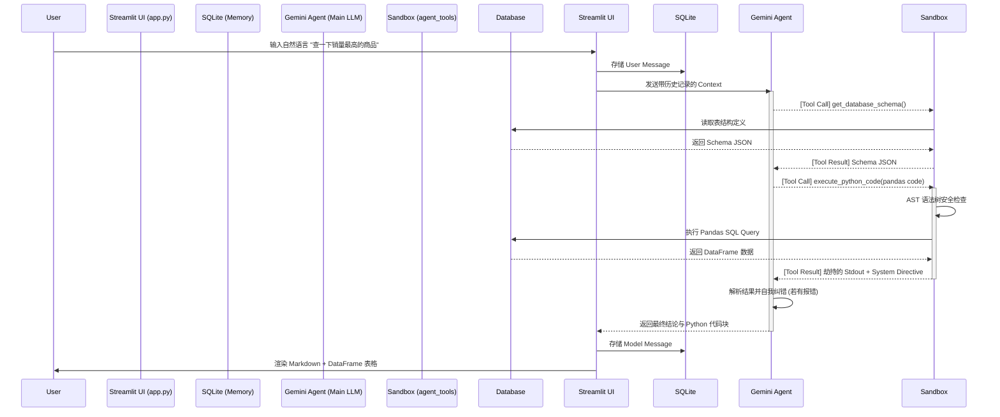

# 🏗️ Multi-Agent Data Copilot 系统架构设计文档 (System Architecture)

本文档旨在从全局视角，系统性地梳理 Data Copilot 的模块划分、数据流转机制以及底层架构设计。

---

## 1. 系统核心组件划分 (Components)

整个项目遵循松耦合、高内聚的设计原则，主要划分为以下四个核心大类：

1. **Frontend / UI 层 (`app.py`)**
   * 负责状态管理 (State Management)、历史记录渲染与双轨执行模式 ("Execute" vs "Preview") 路由。
2. **Agent / 调度层 (`agent_loop.py`, `agent_tools.py`)**
   * 定义了大模型的 System Prompt，注册了 `get_database_schema` 和 `execute_python_code` 工具，负责处理 Tool Calling 闭环与限流。
3. **Sandbox / 执行层 (`executor.py`, `db_reader.py`)**
   * 安全沙盒环境。利用 AST 和 Regex 拦截高危操作，提供有限的 `globals()` 上下文供 `exec()` 运行大模型生成的代码。
4. **Memory / 存储层 (`memory_manager.py`, `compression_agent.py`)**
   * 核心存储枢纽。SQLite 负责 CRUD 会话明细；后台压缩智能体负责将数据推送到 ChromaDB 做向量持久化。

---

## 2. 核心系统调用链路 (Data Flow Sequence)

当你提出一个数据查询请求时，系统内部的数据流转如下：



---

## 3. 双引擎记忆架构设计 (Dual-Memory Architecture)

系统抛弃了传统的 List Append 记忆法，转而采用工业级的 RAG (Retrieval-Augmented Generation) 架构设计。

```mermaid
graph TD
    A[用户当前 Query] --> B{是否存在相似历史?}
    
    subgraph Episodic Memory (情景短时记忆)
        C[SQLite: history 表]
        D[SQLite: sessions 表]
    end
    
    subgraph Semantic Memory (语义长期记忆)
        E[后台大模型: compression_agent.py]
        F[(ChromaDB 向量库)]
    end
    
    C -->|后台闲时抽取| E
    E -->|浓缩业务逻辑| F
    
    F -->|余弦相似度检索| B
    B -->|注入 Prompt Context| G[主 Agent 进行最终回答]
```

**设计哲学**：
*   **Episodic Memory (SQLite)** 是“短期照相机”，它精准地记录了对话的每一个字，保证了 UI 左侧边栏的准确还原。
*   **Semantic Memory (ChromaDB)** 是“长期经验池”，它去除了冗余的问候语和具体数据，只保留“方法论”。通过 `all-MiniLM-L6-v2` 嵌入模型，实现了跨越时间的隐式规则继承。

---

## 4. 目录结构与代码流向 (Directory Structure)

```text
data_copilot/
├── app.py                 # 系统的总入口点，掌控 Streamlit 渲染生命周期
├── agent_loop.py          # 控制台版本的 Agent 循环，现已作为底层逻辑被 app.py 集成
├── agent_tools.py         # 存放提供给大模型的 Native Tools (带 4s 令牌限流保护)
├── executor.py            # 本地代码安全沙盒，包含 stdout 劫持与危险关键词拦截
├── db_reader.py           # 专门负责抽提目标数据库 Schema 的只读组件
├── memory_manager.py      # SQLite 数据库的 CRUD 接口封装层
├── compression_agent.py   # 后台独立运行的第二大模型，负责记忆降维与 ChromaDB 交互
├── memory_episodic.db     # 本地生成的 SQLite 物理文件
└── .streamlit/            # Streamlit 配置文件 (如暗黑模式 UI 设定)
```

## 5. 安全防御体系 (Security Shield)

系统在 `executor.py` 层建立了三道防线：
1.  **Read-Only 拦截器**：通过正则表达式和简单的抽象语法树 (AST) 解析，如果代码字符串中包含 `DROP`, `DELETE`, `UPDATE`, `TRUNCATE` 等关键字，直接抛出 `PermissionError`，拦截于执行前。
2.  **受限环境 (Restricted Environment)**：利用 Python `exec()` 的特性，向 `custom_globals` 字典中仅注入必要的依赖（如 `pd`, `create_engine`, 以及当前会话的 `db_uri`），彻底屏蔽 `os`, `sys`, `subprocess` 等越权操作库。
3.  **Human-in-the-Loop**：UI 层面设计的 `Preview SQL Only` 按钮，允许在生产环境中由 DBA 审查 SQL 后，再交由系统放行。
